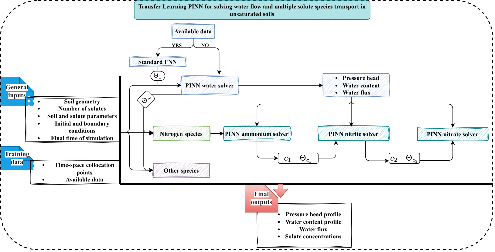

# A transfer learning physics-informed deep learning framework for modeling multiple solute dynamics in unsaturated soils

This repository contains the code implementations used for the research paper titled "A transfer learning physics-informed deep learning framework for modeling multiple solute dynamics in unsaturated soils."

## Abstract

Modeling subsurface flow and transport phenomena is essential for addressing a wide range of challenges in engineering, hydrology, and ecology. The Richards equation is a cornerstone for simulating infiltration, and when coupled with advection–dispersion equations, it provides insights into solute transport. However, the complexity of this coupled model increases significantly when dealing with multiple solute transport. Physics-informed neural networks (PINNs) offer a flexible technique that merges data-driven approaches with the underlying physics principles, enabling the direct incorporation of physical laws or constraints into the neural network training process. Nevertheless, employing PINNs for solving multi-physics problems can present challenges during training, particularly in achieving convergence to realistic concentration profiles. Our study introduces a transfer learning technique to tackle the challenge of modeling multiple species transport in unsaturated soils. This approach aims to improve the accuracy of the PINN framework by decoupling the training process and solving the governing partial differential equations (PDEs) sequentially. We incorporate various strategies to optimize and accelerate the training process. Specifically, we begin by solving the Richards equation and then transfer the acquired knowledge to subsequent solute PINN solvers. This strategy leverages the fact that these PDEs have some similarities in their structure as advection–diffusion equations. To rigorously validate our approach, we conduct 1D numerical experiments and extend our analysis to encompass 2D problems, and inverse problems for homogeneous soils, as well as numerical tests using layered soils. Our findings indicate that transferring learned features is more advantageous than utilizing random features, highlighting the effectiveness of the proposed strategy.

## Authors

- **Hamza Kamil** (a,b)
- **Azzeddine Soulaïmani** (b)
- **Abdelaziz Beljadid** (a,c)

## Affiliation

- **Mohammed VI Polytechnic University, Morocco** (a)
- **École de technologie supérieure, Canada** (b)
- **University of Ottawa, Canada** (c)

## Key Points

(a) For a detailed understanding of the numerical setup for each case, please refer to the accompanying research paper.
(b) The PINNs solvers are implemented using the TensorFlow library.

## Getting Started

To use the code, follow these steps:
1. Use Google Colab or set up the code on your local machine.
2. Install the required libraries, including TensorFlow.
3. Explore the code files to understand the implementation details.

## Note

This repository is intended to serve as a resource for researchers and practitioners interested in advanced solvers for solving partial differential equations related to water flow and mulitple solute transport in unsaturated soils.
Contributions and improvements are welcome. Feel free to submit pull requests or open issues for any questions or suggestions.

## Contact Information

For inquiries, please reach out to:
- **Hamza Kamil** (hamza.kamil@um6p.ma, hamza.kamil.1@ens.etsmtl.ca)

## Citation

```bibtex
@article{KAMIL2024117276,
title = {A transfer learning physics-informed deep learning framework for modeling multiple solute dynamics in unsaturated soils},
journal = {Computer Methods in Applied Mechanics and Engineering},
volume = {431},
pages = {117276},
year = {2024},
issn = {0045-7825},
doi = {https://doi.org/10.1016/j.cma.2024.117276},
url = {https://www.sciencedirect.com/science/article/pii/S0045782524005322},
author = {Hamza Kamil and Azzeddine Soulaïmani and Abdelaziz Beljadid},
}
```

## Framework Overview



This image illustrates the Transfer Learning Physics-Informed Neural Network (TL-PINN) framework used in our study. It provides a visual representation of how the transfer learning approach is applied to model multiple solute dynamics in unsaturated soils.
