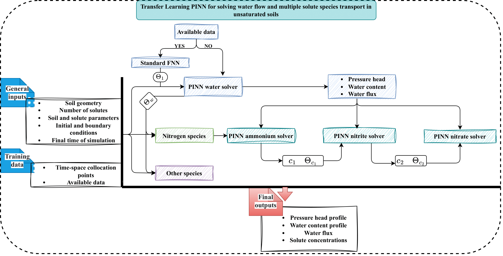

# A Transfer Learning Physics-Informed Deep Learning Framework for Modeling Multiple Solute Dynamics in Unsaturated Soils

This repository contains the code implementations used for the research paper titled:

**“A transfer learning physics-informed deep learning framework for modeling multiple solute dynamics in unsaturated soils.”**

## Abstract

Modeling subsurface flow and transport phenomena is essential for addressing a wide range of challenges in engineering, hydrology, and ecology. The Richards equation is a cornerstone for simulating infiltration, and when coupled with advection–dispersion equations, it provides insights into solute transport. However, the complexity of this coupled model increases significantly when dealing with multiple solute transport.

Physics-informed neural networks (PINNs) offer a flexible technique that merges data-driven approaches with the underlying physics principles, enabling the direct incorporation of physical laws or constraints into the neural network training process. Nevertheless, employing PINNs for solving multi-physics problems can present challenges during training, particularly in achieving convergence to realistic concentration profiles.

Our study introduces a transfer learning technique to tackle the challenge of modeling multiple species transport in unsaturated soils. This approach aims to improve the accuracy of the PINN framework by decoupling the training process and solving the governing partial differential equations (PDEs) sequentially. We begin by solving the Richards equation and then transfer the acquired knowledge to subsequent solute PINN solvers. This strategy leverages the fact that these PDEs have similarities in their structure as advection–diffusion equations.

To rigorously validate our approach, we conduct one-dimensional numerical experiments and extend the analysis to two-dimensional problems, inverse problems for homogeneous soils, and numerical tests using layered soils. The results show that transferring learned features is more advantageous than using random initialization, highlighting the effectiveness of the proposed strategy.

## Code Version

This repository contains a new organization of the code released in 2024.

At this stage, the original implementation is kept in the `codes/` folder to ensure reproducibility of the results reported in the paper. A cleaner and more modular package-style version of the code is under development and will be added in a future update.

## Repository Organization

The repository is currently organized as follows:

```text
.
├── data/
│   └── Data.csv
├── codes/
│   ├── forward_problem.py
│   └── Inverse_problem.py
├── Model_Chart.png
├── requirements.txt
└── README.md
```

* `data/` contains the reference data generated by HYDRUS-1D software.
* `codes/` contains the original forward and inverse TL-PINN scripts released with the 2024 paper.
* `Model_Chart.png` shows the general TL-PINN framework.
* `requirements.txt` lists the main Python dependencies.

## Running the scripts

First, install the required packages:

```bash
pip install -r requirements.txt
```

Then run the forward problem:

```bash
python codes/forward_problem.py
```

To run the inverse problem:

```bash
python codes/Inverse_problem.py
```

## Requirements

The code was originally developed using TensorFlow 1-style syntax through `tf.compat.v1`. For this reason, eager execution is disabled in the scripts.


## Reproducibility

The scripts set random seeds for NumPy, Python, and TensorFlow. However, small differences in the results may occur depending on the hardware, TensorFlow version, GPU/CPU execution, and mini-batch sampling.

For a detailed explanation of the numerical setup, physical parameters, and boundary conditions, please refer to the accompanying research paper.

## Authors

* **Hamza Kamil** (a,b)
* **Azzeddine Soulaïmani** (b)
* **Abdelaziz Beljadid** (a,c)

## Affiliation

* **University Mohammed VI Polytechnic, Morocco** (a)
* **École de technologie supérieure, Canada** (b)
* **University of Ottawa, Canada** (c)

## Key Points

* The proposed method solves the Richards equation first and then transfers the learned features to the solute transport PINN solvers.
* The framework is designed for modeling multiple solute dynamics in unsaturated soils.
* The original scripts are implemented using TensorFlow backend.
* For a detailed understanding of the numerical setup for each case, please refer to the accompanying research paper.

## Framework Overview



This image illustrates the Transfer Learning Physics-Informed Neural Network (TL-PINN) framework used in the study. It provides a visual representation of how transfer learning is applied to model multiple solute dynamics in unsaturated soils.

## Citation

If you use this code, please cite the following paper:

```bibtex
@article{KAMIL2024117276,
title = {A transfer learning physics-informed deep learning framework for modeling multiple solute dynamics in unsaturated soils},
journal = {Computer Methods in Applied Mechanics and Engineering},
volume = {431},
pages = {117276},
year = {2024},
issn = {0045-7825},
doi = {https://doi.org/10.1016/j.cma.2024.117276},
url = {https://www.sciencedirect.com/science/article/pii/S0045782524005322},
author = {Hamza Kamil and Azzeddine Soulaïmani and Abdelaziz Beljadid},
}
```

## Contact Information

For inquiries, please reach out to:

* **Hamza Kamil**
  [hamza.kamil@um6p.ma](mailto:hamza.kamil@um6p.ma)
  [hamza.kamil.1@ens.etsmtl.ca](mailto:hamza.kamil.1@ens.etsmtl.ca)

## Note

This repository is intended to serve as open-source code for researchers and practitioners interested in physics-informed deep learning algorithms for solving differential equations and modeling flow and transport processes in unsaturated soils.

Contributions and improvements are welcome. Feel free to submit pull requests or open issues for questions or suggestions.
